## 7.2 slam-toolbox建图
### 7.2.1 构建第一张导航地图 

#### (1)安装slam-toolbox
```sh
S sudo apt install ros-SROS_DlSTRO-slam-toolbox
```

#### (2)gazebo_sim.launch.py
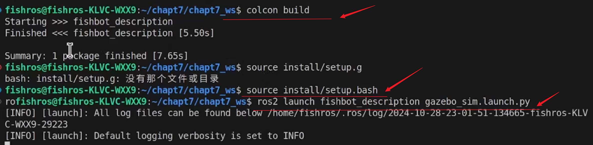
```sh
fishros@fishros-KLVC-WXX9:~/chapt7/chapt7_ws$ colcon build
fishros@fishros-KLVC-WXX9:~/chapt7/chapt7_ws$ source install/setup.bash
fishros@fishros-KLVc-WXX9:-/chapt7/chapt7_ws$ ros2 launch fishbot_description gazebo_sim.launch.py
```
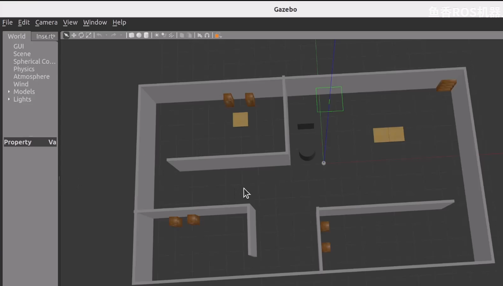


#### (3)launch slam_toolbox online_async_launch.py
```sh
S ros2 launch slam_toolbox online_async_launch.py use_sim_time:=True
```

#### (4) 打开rviz2
```sh
# 在新终端中
rviz2
```

添加 map : [04rviz2-add-map.png](ch07imgs/7.2.1-04rviz2-add-map.png)

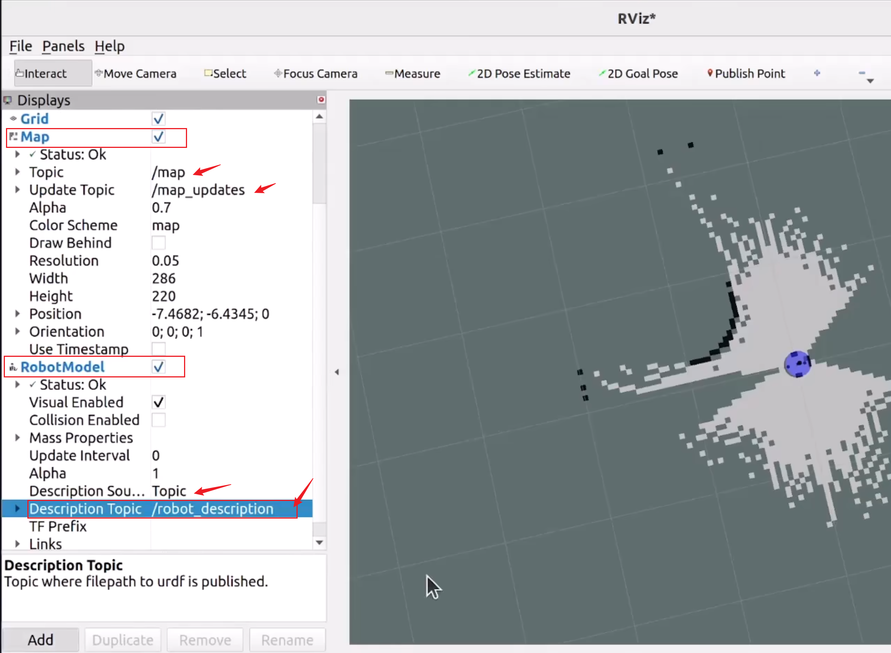

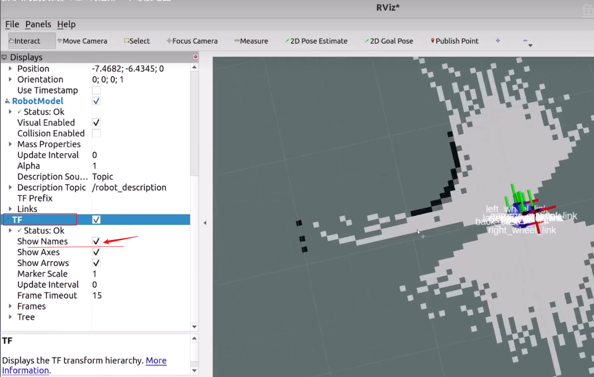

#### (5) 终端中 启动键盘控制node,控制机器人移动完成建图
终端中 启动键盘控制node,
```sh
$ ros2 run teleop_twist_keyboard teleop_twist_keyboard 
```
用键盘 控制机器人移动, 完成建图.

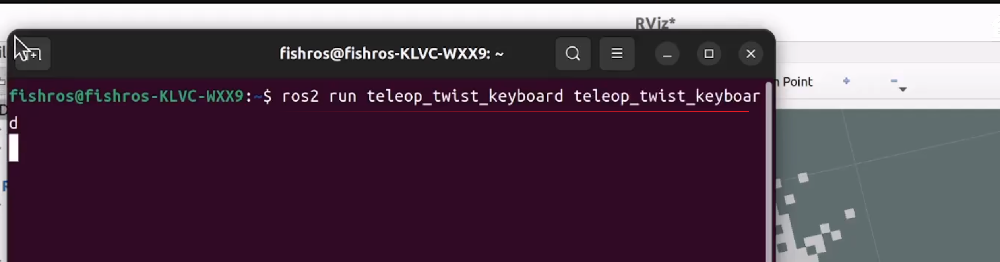

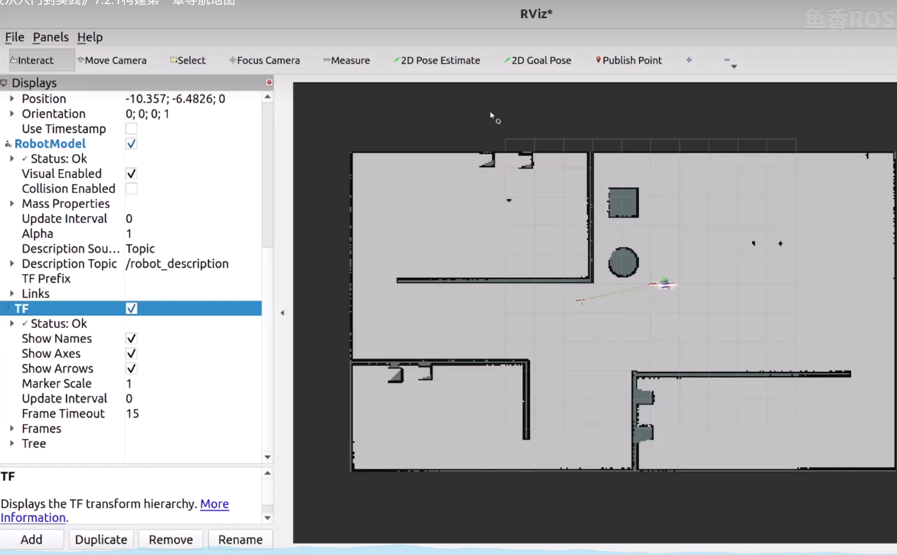


### 7.2.2 将地图保存为文件

#### (1)安装 地图服务map-server 
```sh 
$ sudo apt install ros-$ROS_DISTRO-nav2-map-server
```

#### (2)保存地图
```sh
fishros@fishros-KLVc-WxX9:-/chapt7/chapt7_ws/src$ ros2 pkg create fishbot_navigation2
```

```sh
fishros@fishros-KLVc-WxX9:-/chapt7/chapt7_ws/src/fishbot_navigation2/maps$  ros2 run nav2_map_server map_saver_cli -f room
```
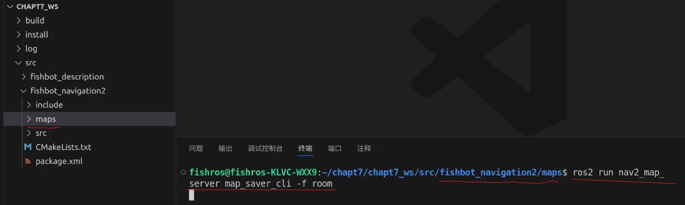

occupied-grid : 占据栅格地图

## 7.3 Navigation2
### 7.3.1 Navigation2 介绍与安装
```sh 
# navigation2      功能包
sudo apt install ros-$ROS_DISTRO-navigation2
# navigation2启动示例功能包
sudo apt install ros-$ROS_DISTRO-nav2-bringup
```

### 7.3.2 配置 Navigation2 参数

#### (1)复制配置文件 nav2_params.yaml
```sh
# 复制配置文件
cp /opt/ros/$ROS_DISTR0/share/nav2_bringup/params/nav2_params.yaml src/fishbot_navigation2/config
```
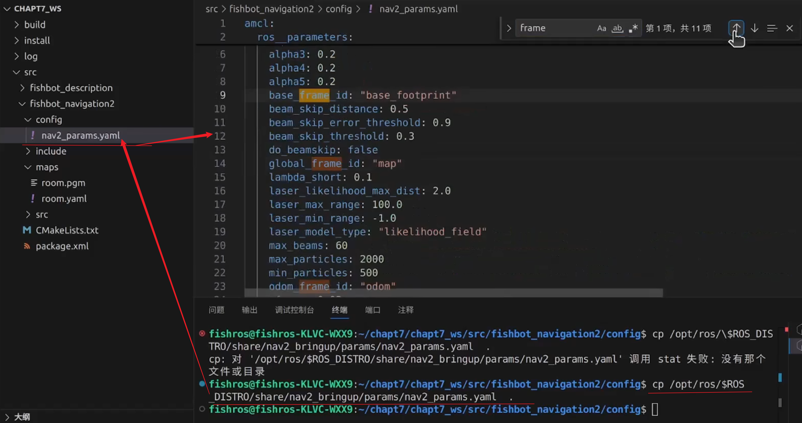

#### (2) 修改 机器人半径 参数

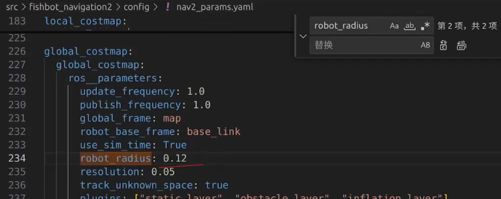
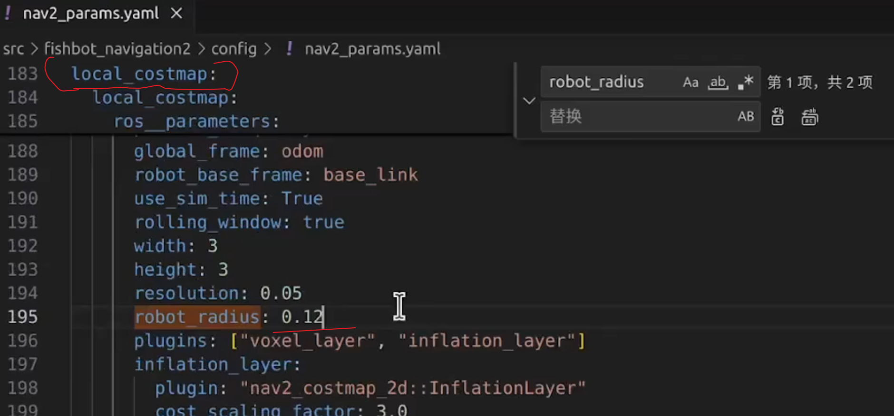

### 7.3.3 编写 launch 启动导航

_ws/src/fishbot-navigation2/launch/navigation2.launch.py
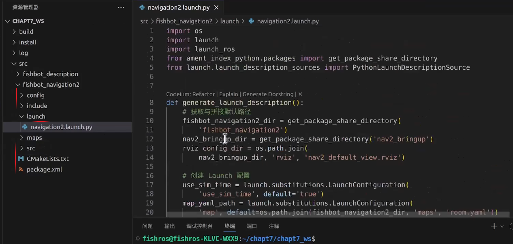


launch gazebo_sim.launch.py
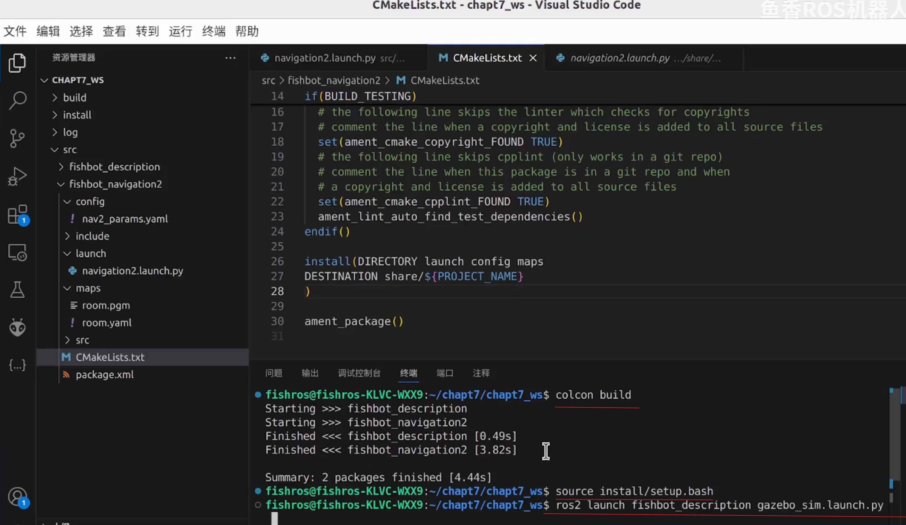


launch navigation2.launch.py
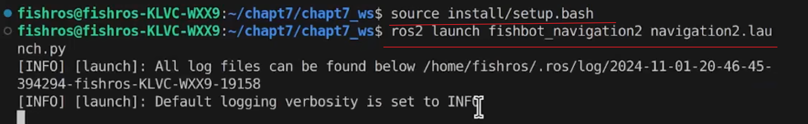

